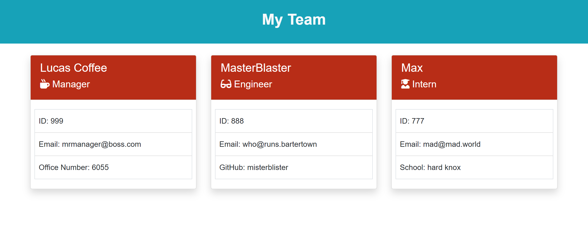

# OOP_Template-Engine
A Node CLI that takes in information about employees and generates an HTML webpage that displays summaries for each person. Also comes equipped with test for each page of javascript. 

## Getting Started
Once you have a copy of the project on your machine, open a CLI (command line interface). Navigate in the CLI to the OOP_Template-Engine directory. Type and enter "npm install". Once installation is complete, you can run the program by typing and entering "node app.js".
Complete the prompts to build a team, and the finished html doc will save in the output folder as team.html

Open team.html in browser to see the team page!

## Built With
* [HTML](https://developer.mozilla.org/en-US/docs/Web/HTML)
* [CSS](https://developer.mozilla.org/en-US/docs/Web/CSS)
* [Javascript](https://developer.mozilla.org/en-US/docs/Web/JavaScript)
* [NPM](https://www.npmjs.com/)

## Authors
Lucas Coffee
- [Link to Portfolio Site](https://kalashnikoffee.github.io/portfolio2/)
- [Link to Github](https://github.com/kalashnikoffee)
- [Link to LinkedIn](https://www.linkedin.com/in/lucas-coffee-08853719/)

## License
See license in OOP_Team-Engine/LICENSE

## Acknowledgments
Thanks again to Jerome, Kerwin, and Mahisha for their guidance.
